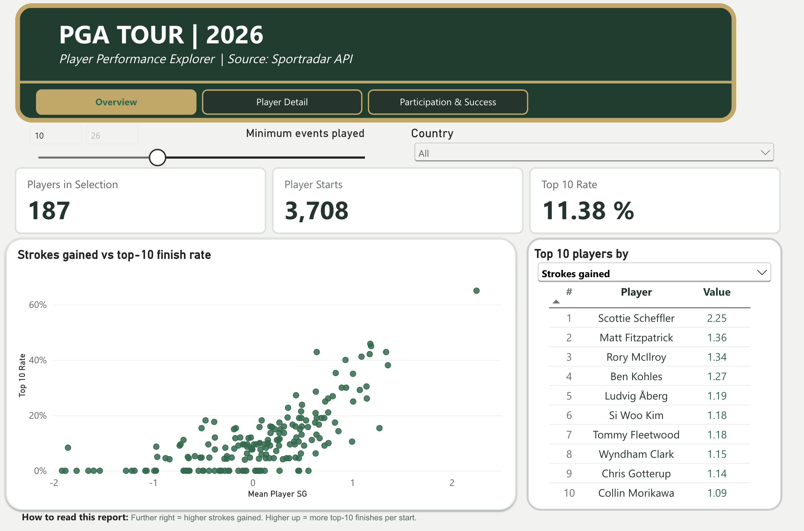

# PGA Tour Player Performance Explorer

A golf analytics project combining **Python, the Sportradar API, MySQL, and Power BI** to explore PGA Tour player performance.

The project takes season-level statistics from a nested API response, prepares structured datasets, stores them in MySQL, and presents player comparisons through a three-page Power BI report.

## Why I Built This

I built this project to practise the complete workflow from collecting data to presenting it in an interactive report. Golf provided a practical setting for exploring how player performance, finishing results, and tournament participation relate to one another.

The project brings together API integration, data preparation, database loading, DAX measures, and dashboard design.

## Questions the Report Explores

- How does strokes gained relate to top-10 finish rate?
- Which players lead across different performance measures?
- How does an individual player compare with the wider player group?
- How do performance and finishing rates vary with the number of events played?

## Skills Demonstrated

| Area | Application |
| --- | --- |
| API integration | Request and parse authenticated JSON responses. |
| Python and pandas | Transform nested records into structured datasets. |
| Data preparation | Standardise text, inspect fields, and calculate performance rates. |
| MySQL | Store prepared data in relational tables. |
| Power BI and DAX | Build interactive comparisons, performance measures, and leaderboards. |
| Data communication | Organise the report around clear analytical questions. |

## Power BI Report

**Report file:** [Download PGA Stats Explorer.pbix](PGA%20Stats%20Explorer.pbix?raw=true)

The report contains three pages:

| Page | What it shows |
| --- | --- |
| **Overview** | Player counts, player starts, top-10 finish rate, a strokes-gained scatter chart, and a selectable leaderboard. Country and minimum-event filters help narrow the comparison. |
| **Player Detail** | Individual player statistics, comparison with a tour-average benchmark, and season finishing results. |
| **Participation & Success** | Strokes gained and top-10 rates by participation level, with charts and a summary table comparing player groups. |

DAX measures support player counts, performance rates, comparisons, and leaderboard rankings. The report uses a consistent green-and-gold theme and page navigation.

### Opening the Report

Download `PGA Stats Explorer.pbix` and open it in Power BI Desktop on Windows. The file allows you to explore the visuals and inspect the included model and DAX measures.

## Data Pipeline

The notebook works with one season of PGA Tour player statistics and is configured for **2026**.

### 1. Extract

- Request season-level player statistics from the Sportradar Golf API.
- Authenticate using credentials loaded from environment variables.
- Parse the JSON response and access each player’s nested statistics.

### 2. Transform

The notebook prepares two pandas DataFrames:

| Dataset | Contents |
| --- | --- |
| **Main player data** | Player names, country, world ranking, events played, wins, runner-up finishes, top-10 and top-25 finishes, cuts made, FedEx ranking, strokes gained, and calculated win and top-10 percentages. |
| **Detailed statistics** | Player names and identifiers, driving accuracy, greens in regulation, sand saves, scrambling, scoring average, a derived putting measure, and strokes gained. |

Preparation includes inspecting data types and non-null counts, standardising country names, and calculating:

| Metric | Calculation |
| --- | --- |
| Win percentage | Wins ÷ events played × 100 |
| Top-10 percentage | Top-10 finishes ÷ events played × 100 |

These percentages are rounded to two decimal places. Players with zero or negative events played receive missing percentage values.

The notebook also derives `putts_per_round` as the API’s `putt_avg` value multiplied by 18.

### 3. Load

SQLAlchemy and PyMySQL load the prepared datasets into MySQL:

- `players_main` — main player data and calculated percentages.
- `players_statistics` — detailed performance statistics.

Each load replaces the corresponding table and excludes the pandas index.

## Scope and Limitations

- Results represent the API data available when extracted; the report is not a live feed.
- The notebook does not retain historical snapshots when replacing database tables.
- Rates based on few events can be unstable. The minimum-event filter helps compare players with more substantial participation.
- Total player starts count player appearances, not unique tournaments.
- Wins, top-10 finishes, and top-25 finishes overlap and should not be added together as separate outcome categories.
- Relationships between participation and performance describe associations, not evidence of causation.
- API response validation, retries, and handling for missing fields remain areas for improvement.

## Future Improvements

- Record extraction dates and retain historical snapshots.
- Add API response validation and automated data-quality checks.
- Document source definitions and units for each performance metric.
- Automate the refresh process between the prepared data and Power BI.

**Data source:** Sportradar Golf API.
